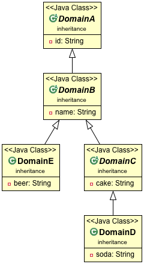

# Mapstruct mapping issue

Domain model using inheritance (simplified)

DTO model using composition (simplified)
Each superclass from the domain model is a separate message field in the corresponding DTO class.

## Current way of solving it

Add @Mapping-annotations for each field, repeat for each concrete class.

[See here](src/main/java/mapper/MappingAnnotationRepeatMapper.java)

## Possible ways ahead for mapstruct

[See here for example and discussion](src/main/java/mapper/CompositionAndInheritanceMapper.java)
